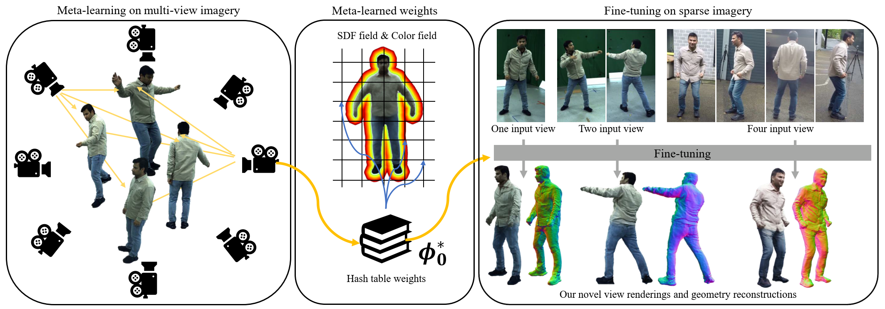
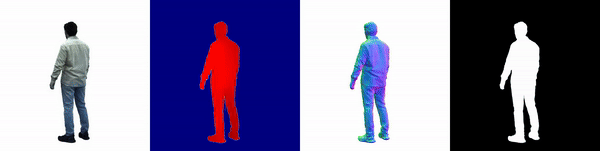

# MetaCap

## [Project Page](https://vcai.mpi-inf.mpg.de/projects/MetaCap/) | [Paper](https://arxiv.org/abs/2403.18820) | [Dataset](https://gvv-assets.mpi-inf.mpg.de/MetaCap) 

This repository contains the implementation of our ECCV 2024 paper "MetaCap: Meta-learning Priors from Multi-View Imagery for Sparse-view Human Performance Capture and Rendering". 
You can visit [project page](https://vcai.mpi-inf.mpg.de/projects/MetaCap/) for more illustrations.



## :hammer_and_wrench: Requirements
If GCC<11.0:
- Create conda environment `conda create --name metacap python=3.8`
- Install cuda11.6: `conda install cudatoolkit=11.6 cudnn -c conda-forge`, then `conda install cudatoolkit-dev=11.6 -c conda-forge`
- Install PyTorch==1.13.1+cu116: `pip install torch==1.13.1+cu116 torchvision==0.14.1 --extra-index-url https://download.pytorch.org/whl/cu116` 
- Install tiny-cuda-nn PyTorch extension: `pip install git+https://github.com/NVlabs/tiny-cuda-nn/@v1.6#subdirectory=bindings/torch`
- `pip install -r requirements.txt`
- Install pytorch3d: `pip install --no-cache-dir pytorch3d==0.7.2 -f https://dl.fbaipublicfiles.com/pytorch3d/packaging/wheels/py38_cu116_pyt1131/download.html`
- Install kaolin: `pip install kaolin==0.13.0 -f https://nvidia-kaolin.s3.us-east-2.amazonaws.com/torch-1.13.1_cu116.html`
- Install nerfacc: `pip install nerfacc==0.3.3 -f https://nerfacc-bucket.s3.us-west-2.amazonaws.com/whl/torch-1.13.0_cu116.html`
- Install point inside-outside check module:
    ```
    cd ./tools/extensions/libmesh
    python setup.py build_ext --inplace
    cd ../../..
    ```
<details>
<summary><b>If GCC>=11.0:</b></summary>

  - Create conda environment `conda create --name metacap python=3.9`
  - Install cuda11.8: `conda install cudatoolkit=11.8 cudnn -c conda-forge`, `cudatoolkit-dev=11.8` doesn't exist yet.
  - Install PyTorch==2.0.0+cu118: `pip install torch==2.0.0 torchvision==0.15.1 torchaudio==2.0.1 --index-url https://download.pytorch.org/whl/cu118 --no-cache-dir` 
  - Install tiny-cuda-nn 1.7 PyTorch extension from source: `https://github.com/NVlabs/tiny-cuda-nn?tab=readme-ov-file#compilation-windows--linux`
  - `pip install -r requirements.txt`
  - Install pytorch3d: `pip install --no-cache-dir pytorch3d==0.7.3 -f https://dl.fbaipublicfiles.com/pytorch3d/packaging/wheels/py39_cu118_pyt200/download.html`
  - Install kaolin: `pip install kaolin==0.14.0 -f https://nvidia-kaolin.s3.us-east-2.amazonaws.com/torch-2.0.0_cu118.html`
  - Install nerfacc 0.3.3 from source: `https://github.com/nerfstudio-project/nerfacc/releases`
  - Install point inside-outside check module:
      ```
      cd ./tools/extensions/libmesh
      python setup.py build_ext --inplace
      cd ../../..
      ```
</details>


## :movie_camera: Data
<details open>
    <summary><b>Prepare Data</b></summary>

    # Step 1: Download demo data from https://gvv-assets.mpi-inf.mpg.de/MetaCap and place them in ./datas
    # datas
    #   ├── ddc_configs (exists there)
    #   ├── vis (exists there)
    #   ├── preprocess_data.py (exists there)
    #   ├── render_depth_s5.py (exists there)
    #   ├── color_proxy_s2
    #   ├── rotate_dir
    #   └── demo
    
    # Step 2: Download SMPL from: https://smpl.is.tue.mpg.de/ and place the model in ./datas/SMPLX/smpl/
    # datas
    #   └── SMPLX/smpl/
    #         ├── SMPL_FEMALE.pkl
    #         ├── SMPL_MALE.pkl
    #         └── SMPL_NEUTRAL.pkl
    
    # Step 3: Download WildDynaCap and DynaCap from: https://gvv-assets.mpi-inf.mpg.de/MetaCap to /XX/XX/WildDynaCap_official(where to save dataset)
    #         Edit the script "./data/process_data.py", base_dir = /XX/XX/WildDynaCap_official
    #         Run the following scripts to generate training datas and testing datas:
    cd ./datas
    python ./preprocess_data.py -subi 2 -ct tight -st training
    python ./preprocess_data.py -subi 2 -ct tight -st training -cs
    python ./preprocess_data.py -subi 2 -ct tight -st testing
    python ./preprocess_data.py -subi 2 -ct tight -st testing -cs
    python ./preprocess_data.py -subi 2 -ct tight -st inTheWild
    python ./preprocess_data.py -subi 2 -ct tight -st inTheWild -cs
    ln -s /XX/XX/WildDynaCap_official/Subject0002 ./Subject0002
    # change the subj idx and ct to process other subjects
    cd ..
</details>

## :triangular_flag_on_post: Edit Config before Training or Testing
1. Edit configs/base.yaml **root_dir** for where you put this repository.
2. Edit **exp_dir** and **runs_dir** for where to save experiment results and logs.
3. Link result and log folders to under the repository folder. `ln -s /XXX/XXX/results/metacap/exp ./exp`, and `ln -s /XXX/XXX/results/metacap/runs ./runs`
<details>
    <summary><b>Config Flag Meaning</b></summary>

    dataset.cano_motion: template or cano, the motion of canonical pose.
    dataset.deformer: ddc or smpl, the human template used in experiments.
    dataset.rotate: True or False, spherial rendering or specific view rendering during testing phase.
    dataset.smoothDQ: True or False, smooth the DQ format transformations or not.
    dataset.preload: True or False, preload images, masks or not during the meta-learning phase.

    model.grid_pre: True or False, pre-compute grid density or not.
    model.decay_step: The iteration step to decay threshold_outer during training phase.

    export.save_mesh: True or False, saveing mesh or not during testing or evaluation phase.
</details>

## :leopard: Fast Demo
- 
<details>
    <summary><b>Demo in the Dome</b></summary>

    # Run finetuning on sparse dome images and visualize them through spherical rendering.
    python launch.py --config configs/s2/finetuning/neus-domedenseraw-ddc-s2-smooth2-test-finetune2-new2-meta-demo.yaml --gpu 0 --train \
            --ckpt  ./datas/demo/Subject0002/tight/ckpt/epoch=0-step=2000.ckpt \
            dataset.frame=1000 tag=Debug_Cano_Meta_DDC_Rotate dataset.cano_motion=template \
            trainer.val_check_interval=4000 dataset.threshold_outer=0.05 model.decay_step=5000 dataset.rotate=True
</details>
<details>
    <summary><b>Demo in the Wild</b></summary>

    # Run finetuning on sparse itw images and visualize them through spherical rendering.
    python launch.py --config configs/s2/finetuning/neus-domedenseraw-ddc-s2-smooth2-itw-finetune2-new2-meta-demo.yaml --gpu 0 --train \
            --ckpt  ./datas/demo/Subject0002/tight/ckpt/epoch=0-step=2000.ckpt \
            dataset.frame=3300 tag=Debug_Cano_Meta_DDC_Rotate dataset.cano_motion=template \
            trainer.val_check_interval=4000 dataset.threshold_outer=0.05 model.decay_step=5000 dataset.rotate=True
</details>

## :runner: Run
<details>
    <summary><b>Meta-learning Prior</b></summary>

    # Meta-learning with DDC
    python launch.py --config configs/s2/metalearning/metaneusseq-domedenserawseq_meta-ddc-s2-smooth2-24-more-newthreshold0-100Frame-100Camera.yaml --gpu 0 --train \
    tag=Test_Down2.0_Blur_100Frame_100Camera_DDC dataset.img_downscale=2.0 dataset.blur=True dataset.preload=True
    # Meta-learning with SMPL
    python launch.py --config configs/s2/metalearning/metaneusseq-domedenserawseq_meta-ddc-s2-smooth2-24-more-newthreshold0-100Frame-100Camera.yaml --gpu 0 --train \
    tag=Test_Down2.0_Blur_100Frame_100Camera_SMPL dataset.img_downscale=2.0 dataset.blur=True dataset.preload=True dataset.deformer=smpl dataset.threshold_outer=0.075
</details>

<details>
    <summary><b>Fine-tuning on Sparse-view Images</b></summary>

    # Run finetuning and visualize them through spherical rendering.
    python launch.py --config configs/s2/finetuning/neus-domedenseraw-ddc-s2-smooth2-test-finetune2-new2-meta.yaml --gpu 0 --train \
            --ckpt  ./exp/Subject0002/metaneusseq-domedenseseq_meta-Subject0002/xxxxxxxxxxxxxxxx/ckpt/epoch=0-step=2000.ckpt \
            dataset.frame=3000 tag=Cano_Meta_DDC_Rotate dataset.cano_motion=template \
            trainer.val_check_interval=4000 dataset.threshold_outer=0.05 model.decay_step=5000 dataset.rotate=True
    # Run finetuning and run test code for given camera parameters.
    python launch.py --config configs/s2/finetuning/neus-domedenseraw-ddc-s2-smooth2-test-finetune2-new2-meta.yaml --gpu 0 --train \
            --ckpt  ./exp/Subject0002/metaneusseq-domedenseseq_meta-Subject0002/xxxxxxxxxxxx/ckpt/epoch=0-step=2000.ckpt \
            dataset.frame=3000 tag=Cano_Meta_DDC dataset.cano_motion=template \
            trainer.val_check_interval=4000 dataset.threshold_outer=0.05 model.decay_step=5000 dataset.rotate=False
    # Fine-tuning with SMPL
    python launch.py --config configs/s2/finetuning/neus-domedenseraw-ddc-s2-smooth2-test-finetune2-new2-meta.yaml --gpu 0 --train \
            --ckpt  ./exp/Subject0002/metaneusseq-domedenseseq_meta-Subject0002/xxxxxxxxxxxxxxxx-SMPL/ckpt/epoch=0-step=2000.ckpt \
            dataset.frame=3000 tag=Cano_Meta_SMPL dataset.cano_motion=template dataset.deformer=smpl \
            trainer.val_check_interval=4000 dataset.threshold_outer=0.075 model.decay_step=5000 dataset.rotate=True
</details>

<details>
    <summary><b>Fine-tuning on Monocular Image with Occlusion Handling</b></summary>

    python launch.py --config configs/s2/finetuning/neus-domedenseraw-ddc-s2-smooth2-test-finetune2-new2-meta-one-oh.yaml --gpu 0 --train \
           --ckpt  ./exp/Subject0002/metaneusseq-domedenseseq_meta-Subject0002/xxxxxxxxxxxxxxxx/ckpt/epoch=0-step=2000.ckpt \
           dataset.frame=5200 tag=Cano_Meta_DDC_One_OH dataset.cano_motion=template dataset.deformer=ddc trainer.val_check_interval=4000 \
           dataset.threshold_ddc=0.05 model.decay_step=5000 checkpoint.every_n_train_steps=5000 dataset.rotate=True model.grid_pre=False dataset.compute_occlusion=True
</details>

<details>
    <summary><b>Training on Dense-view Images for Ground-truth Geometry (Random Initialization)</b></summary>

    python launch.py --config configs/s2/groundtruth/neus-domedenseraw-ddc-s2-smooth2-test-gt.yaml  --gpu 0 --train \
            dataset.frame=3000 tag=World_GT dataset.cano_motion=world trainer.val_check_interval=4000 \
            dataset.threshold_outer=0.1 dataset.threshold_ddc=0.1  model.decay_step=5000 dataset.smoothDQ=False
</details>

<details>
    <summary><b>Fine-tuning FPS Evaluation (Testing on NVIDIA RTX 3090, >20FPS)</b></summary>

    # We found the first time run will be a bit slower, run multiple times to get the stable speed.
    python launch.py --config configs/s2/finetuning/neus-domedenseraw-ddc-s2-smooth2-test-finetune2-new2-meta.yaml --gpu 0 --train --notest \
          --ckpt ././exp2/metaneusseq-domedenseseq-Subject0002/XXXXXXXXXXXXXXX/ckpt/epoch=0-step=2000.ckpt\
           dataset.frame=5200 tag=Debug_Time dataset.cano_motion=template dataset.deformer=ddc trainer.val_check_interval=4000 \
           dataset.threshold_ddc=0.05 model.decay_step=5000 checkpoint.every_n_train_steps=5000 dataset.rotate=False model.grid_pre=True export.save_mesh=False  
</details>

<details>
    <summary><b>Interpolation on Two Fine-tuned Frames and Rendering in Canonical Space</b></summary>

    python launch.py --config configs/s2/interpolation/neusinterpolation-domedenseraw-ddc-s2-smooth2-test.yaml --gpu 0 --test \
        --ckpt1 ./exp/Subject0002/XXXXXX/ckpt/epoch=0-step=3000.ckpt \
        --ckpt2 ./exp/Subject0002/XXXXXX/ckpt/epoch=0-step=3000.ckpt  \
        dataset.frame=XXXXX tag=Debug_Interpolation dataset.rotate=True \
        dataset.rotate_template=True dataset.rotate_scale=0.0 export.save_mesh=False 
</details>


## :straight_ruler: Evaluate
<details>
    <summary><b>Evaluation scripts</b></summary>

    cd ./evaluations
    # prepare GT results and MetaCap results
    python ./00_move_Mesh_GT.py
    python ./00_prepare_T_w2s.py
    python ./00_move_RGB_Mask_GT.py
    python ./00_move_metacap.py
    # evaluate rendering and geometry results
    python ./01_evaluate_rgb_metacap.py
    python ./01_evaluate_mesh_metacap.py
    # summarize the final results
    python ./02_summary_evaluate_metacap.py
</details>

## :bookmark_tabs: Code Structure
<details>
    <summary><b>Details</b></summary>
     
    # Configs
    - config files for meta-learning, fine-tuning, ground truth generation and interpolation experiments.

    # Datas
    - render_depth_s5.py: render depth maps for s5 if needed it during the prior training.
    - preprocess_data.py: extract cropped images, masks and camera parameters from raw videos.
    - color_proxy_s2: pre-computed proxy images for the occlusion handling strategy.
    - ddc_configs: configs files for the DDC template and skel_tools.py
    - SMPLX: datas for the SMPL template.
    - rotate_dir: some placeholders for the spherical rendering. To be removed in the future version.
    
    # Datasets
    - domedenseraw.py: fine-tuning or ground-truth fitting or weight interpolation inference on single frame.
    - domedenserawseq_meta.py: meta-learning on multiple frames.
    - human_info.py: information of meta-learning views and frames, testing views and frames. Note that the motion and images of training split and testing split are not overlapped.

    # Evaluations
    - 00_move_xxx.py: moving results to a new folder for evaluation.
    - 01_evaluate_xxx.py evaluating mesh and image metrics.
    - 02_summary_xxx.py summarize the evaluation results.

    # Models
    - xxx.py: basic models for radiance fileds learning and feature embedding.

    # Systems
    - xxx.py: basic systems for model training, testing, and evaluation.

    # Tools
    - skel_tools.py: skeleton, skinned character and embedded graph used in DDC template.
    - pyrender_tools.py: tools for skeleton, mesh, ground and axis visualization.
    - cam_tools.py: functions for camera parameters loading.
    - metric_tools.py: functions for geometry and image evaluation.
    - omni_tools.py: utils for resizing, file creating, file copying...
    - mesh_tools.py: utils for mesh loading, mesh saving and point2mesh prjections...
</details>


## :rose: Acknowledgements
Some great prior works and codes we benefit from: [instant-nsr-pl](https://github.com/bennyguo/instant-nsr-pl), [NerfAcc](https://github.com/nerfstudio-project/nerfacc),
[PyTorch3D](https://github.com/facebookresearch/pytorch3d), [Kaolin](https://github.com/NVIDIAGameWorks/kaolin), [GRAB](https://github.com/otaheri/GRAB), [InstantAvatar](https://github.com/tijiang13/InstantAvatar),
[EasyMocap](https://github.com/zju3dv/EasyMocap), [DDC](https://people.mpi-inf.mpg.de/~mhaberma/projects/2021-ddc/).

## :book:  License
Both the source code and our data are under the terms of the [Attribution-NonCommercial 4.0 International (CC BY-NC 4.0) license](https://creativecommons.org/licenses/by-nc/4.0/legalcode). 
This project is only for research or education purposes, and not freely available for commercial use or redistribution.

## :beer: Citation
If you find the codes or datasets from this repository helpful in your projects, welcome to cite the papers and give a star.
```
@inproceedings{sun2024metacap,
title = {MetaCap: Meta-learning Priors from Multi-View Imagery for Sparse-view Human Performance Capture and Rendering},
author = {Sun, Guoxing and Dabral, Rishabh and Fua, Pascal and Theobalt, Christian and Habermann, Marc},
year = {2024},
booktitle={ECCV}
}
@article{habermann2021,
author = {Marc Habermann and Lingjie Liu and Weipeng Xu and Michael Zollhoefer and Gerard Pons-Moll and Christian Theobalt},
title = {Real-time Deep Dynamic Characters},
journal = {ACM Transactions on Graphics}, 
month = {aug},
volume = {40},
number = {4}, 
articleno = {94},
year = {2021}, 
publisher = {ACM}
} 
```

